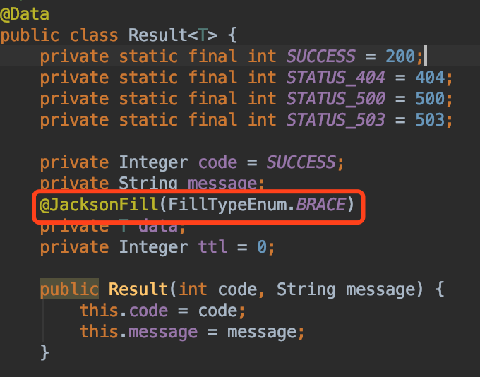
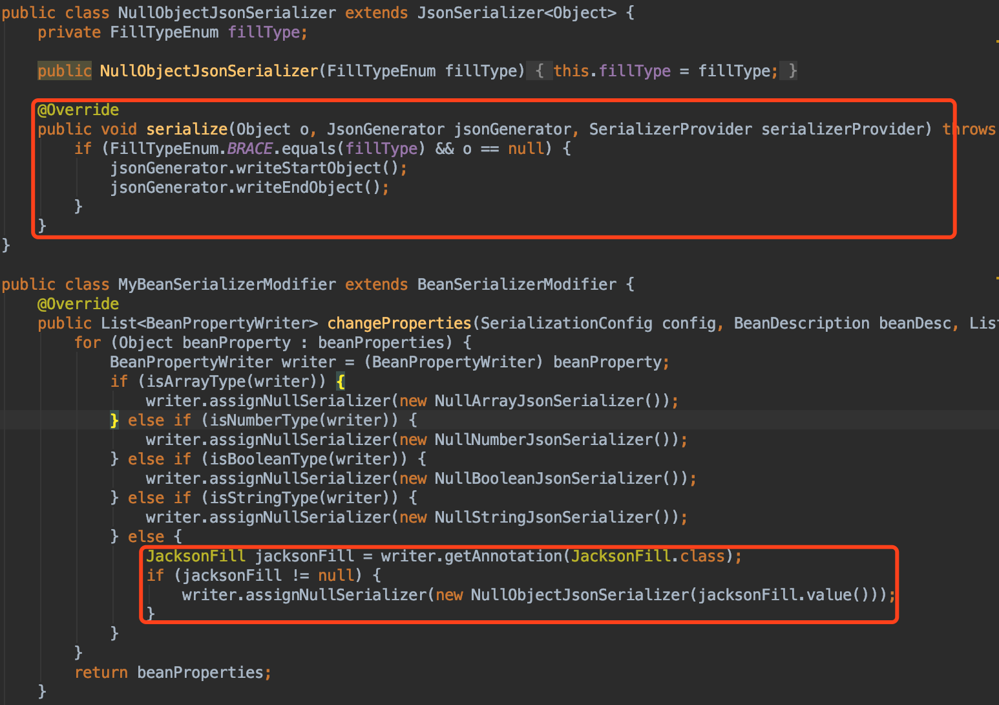

# spring-demo: spring-boot + Redis + MyBatis + Elasticsearch + RocketMQ

# 项目结构

# 项目组件
* [MyBatis](http://www.mybatis.org/mybatis-3/zh/index.html)
* [Redis-jetcache](https://github.com/alibaba/jetcache)
* [RocketMQ](https://github.com/apache/rocketmq-spring/blob/master/README_zh_CN.md)
* [ElasticSearch](https://spring.io/projects/spring-data-elasticsearch)
* [HuTool](https://hutool.cn/docs/#/?id=%e6%96%87%e6%a1%a3)

# 更新 2019-09-04
* Mybatis 升级为 [Mybatis plus](https://mp.baomidou.com/)。并完善多数据源混合使用，动态切换数据源demo。
减少xml配置，自动填充createTime、updateTime字段。
* 增加 Spring RestTemplate + HttpClient组合，时间连接池、超时时间配置。
* logback 多环境配置。
* Jetcache 支持 jedis 操作接口。

# 更新 2019-09-05
* 集成 Mybatis plus 分页插件，增加分页操作Demo。
* 修复 "Mybatis plus mapper-locations 配置错误，找不到 xml" BUG。
* 增加事务操作Demo。

# 更新 2019-10-23
我知道你们等很久了...
* springboot 返回json null 字段初始化。支持 Array、Collection to []; string to "", Boolean to false, 甚至 Object(?) to {} ！！！
废话不多说，上代码

> 很多类都是类型擦除的，所以无法判断Object到底是什么类型。所以无法知道什么时候加"{}",什么时候加""，通过注解的方式，给需要初始化的bean加上一个标记，
在自动以Jackson消息序列器里面，就可以完美实现加上"{}"了！ 
#### Result data 字段加注解。@JacksonFill(FillTypeEnum.BRACE)  

#### Jackson 自定义序列化实现  

# 通用响应

