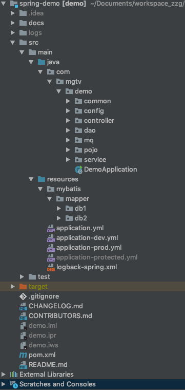
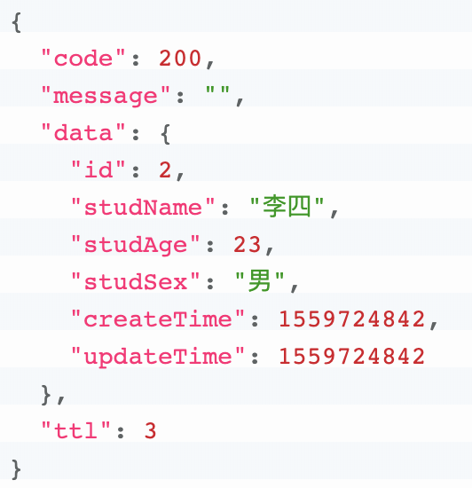

# spring-demo: spring-boot + Redis + MyBatis + Elasticsearch + RocketMQ

# 项目结构

# 项目组件
* [MyBatis](http://www.mybatis.org/mybatis-3/zh/index.html)
* [Redis-jetcache](https://github.com/alibaba/jetcache)
* [RocketMQ](https://github.com/apache/rocketmq-spring/blob/master/README_zh_CN.md)
* [ElasticSearch](https://spring.io/projects/spring-data-elasticsearch)
* [HuTool](https://hutool.cn/docs/#/?id=%e6%96%87%e6%a1%a3)

# 更新 2019-09-04
* Mybatis 升级为 [Mybatis plus](https://mp.baomidou.com/)。并完善多数据源混合使用，动态切换数据源demo。
减少xml配置，自动填充createTime、updateTime字段。
* 增加 Spring RestTemplate + HttpClient组合，时间连接池、超时时间配置。
* logback 多环境配置。
* Jetcache 支持 jedis 操作接口。

# 通用响应

